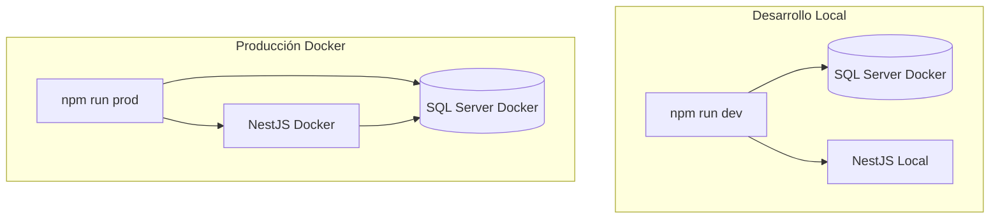

# 🐳 Guía Docker - Transferencia de Automotor

## 📋 Resumen de Cambios Implementados

Esta guía documenta la simplificación y optimización de la configuración Docker siguiendo las mejores prácticas de la industria.

### ✅ Mejoras Implementadas

#### 1. **Un Solo Archivo Docker Compose**
- ❌ **Antes**: `docker-compose.yml` + `docker-compose.dev.yml`
- ✅ **Ahora**: Solo `docker-compose.yml` con **profiles**

#### 2. **Separación por Profiles**
- 🛠️ **Perfil por defecto**: Solo base de datos (desarrollo)
- 🚀 **Perfil `prod`**: Base de datos + aplicación (producción)

#### 3. **Health Checks**
- ✅ SQL Server con health check avanzado
- ✅ Dependencias correctas con `condition: service_healthy`
- ✅ Reintentos y timeouts configurados

#### 4. **Scripts NPM Simplificados**
- 🎯 Comandos más intuitivos y fáciles de recordar
- 🔧 Separación clara entre desarrollo y producción
- 🛠️ Comandos de utilidad para mantenimiento

## 🏗️ Arquitectura Docker



## 📊 Comparación de Comandos

| Acción | Antes | Ahora |
|--------|-------|-------|
| DB para desarrollo | `docker-compose -f docker-compose.dev.yml up -d` | `npm run dev:db` |
| Aplicación completa | `docker-compose up --build -d` | `npm run prod` |
| Ver logs | `docker-compose logs -f app` | `npm run prod:logs` |
| Detener servicios | `docker-compose down` | `npm run dev:db:stop` o `npm run prod:stop` |

## 🎯 Flujos de Trabajo

### 🛠️ Desarrollo Diario

```bash
# 1. Levantar entorno de desarrollo
npm run dev

# 2. La aplicación se ejecuta localmente con hot reload
# 3. La base de datos está en Docker para consistencia

# 4. Al terminar, detener la base de datos
npm run dev:db:stop
```

### 🚀 Despliegue a Producción

```bash
# 1. Construir y levantar toda la aplicación
npm run prod

# 2. Verificar que todo esté funcionando
npm run prod:logs

# 3. Para actualizaciones de código
npm run prod:rebuild
```

## 🔧 Configuración Técnica

### Docker Compose Profiles

El archivo `docker-compose.yml` utiliza profiles para controlar qué servicios se ejecutan:

```yaml
services:
  db:
    # Siempre activo (desarrollo y producción)
    
  app:
    profiles:
      - prod  # Solo se ejecuta con --profile prod
```

### Health Checks

```yaml
healthcheck:
  test: /opt/mssql-tools/bin/sqlcmd -S localhost -U sa -P "TransferApp2024!" -Q "SELECT 1"
  interval: 10s
  timeout: 5s
  retries: 10
  start_period: 10s
```

### Dependencias

```yaml
depends_on:
  db:
    condition: service_healthy  # Espera a que DB esté saludable
```

## 🛡️ Mejores Prácticas Aplicadas

### ✅ Seguridad
- Variables de entorno para credenciales
- Redes aisladas para los contenedores
- Políticas de restart apropiadas

### ✅ Performance
- Health checks para evitar conexiones fallidas
- Volúmenes optimizados para persistencia
- Imágenes base oficiales y actualizadas

### ✅ Mantenibilidad
- Un solo archivo de configuración
- Scripts NPM descriptivos y consistentes
- Documentación clara y actualizada

### ✅ Desarrollo
- Hot reload para desarrollo local
- Base de datos containerizada para consistencia
- Comandos simples para operaciones comunes

## 🚨 Comandos de Emergencia

```bash
# Limpiar todo y empezar de cero
npm run db:clean

# Recrear la base de datos
npm run db:init

# Ver estado de los contenedores
docker ps

# Conectarse a la base de datos manualmente
docker exec -it transferencia-automotor-db /opt/mssql-tools/bin/sqlcmd -S localhost -U sa -P "TransferApp2024!"
```

## 📈 Beneficios de la Nueva Configuración

1. **Simplicidad**: Un solo archivo, comandos más simples
2. **Flexibilidad**: Fácil cambio entre desarrollo y producción
3. **Confiabilidad**: Health checks y dependencias correctas
4. **Mantenibilidad**: Scripts organizados y documentados
5. **Performance**: Optimizaciones en la configuración de Docker
6. **Escalabilidad**: Base sólida para futuras mejoras

## 🔄 Migración

Si estabas usando la configuración anterior:

1. **Detén** todos los contenedores: `docker-compose down`
2. **Elimina** el archivo `docker-compose.dev.yml` (ya no es necesario)
3. **Usa** los nuevos comandos NPM: `npm run dev` o `npm run prod`
4. **Actualiza** tu flujo de trabajo según esta documentación
