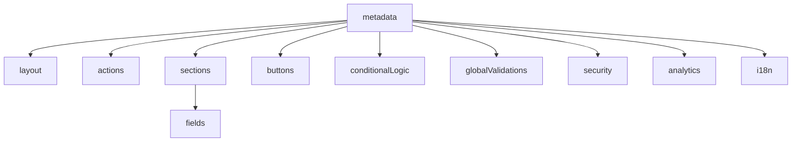

---

# Índice

1. [Introducción](#introducción)
2. [Ciclo de vida de un formulario](#ciclo-de-vida-de-un-formulario)
3. [Estructura general de `DynamicForm`](#estructura-general)
4. [Entidades TypeScript](#entidades-typescript)
5. [Sección por sección](#sección-por-sección)

   1. [metadata](#metadata)
   2. [layout](#layout)
   3. [actions](#actions)
   4. [buttons](#buttons)
   5. [sections](#sections)
   6. [fields](#fields)
   7. [conditionalLogic](#conditionalLogic)
   8. [globalValidations](#globalValidations)
   9. [security](#security)
   10. [analytics](#analytics)
   11. [i18n](#i18n)
6. [Catálogo de tipos de campo + ejemplos completos](#catálogo-de-campos)
7. [Buenas prácticas & recomendaciones](#buenas-prácticas)

---

## Introducción

`DynamicForm` es un contrato JSON enviado por el **backend** y consumido por el **frontend** para renderizar, validar y enviar formularios sin necesidad de código UI específico. Está pensado para ser:

* **Robusto**: soporta seguridad, rate-limiting, i18n, analíticas…
* **Extensible**: agregar nuevos tipos de campo o propiedades sin romper la API.
* **Declarativo**: las reglas de visibilidad, validación y mapeo de datos viven en el JSON.
* **Framework-agnóstico**: puede consumirse desde React, Angular, Vue, etc.

---

## Ciclo de vida de un formulario

1. **Carga**

   * El front pide `/api/forms/:id` y recibe un `DynamicForm`.
2. **Render**

   * Se construyen secciones, campos y botones según el JSON y las reglas `visibleIf / readOnlyIf`.
3. **Interacción**

   * Cambios de campos disparan `events` → fetch/populate/analytics.
4. **Validación**

   * Local: reglas `validation`.
   * Remota: acciones `type:"backend"` o `onValidation`.
5. **Envío**

   * El front genera el payload, respeta `dataMapping` y envía al `actions.submit`.
6. **Respuesta**

   * Redirección o render de mensaje → definido en `actions.submit.successRedirect`.

---

## Estructura general<a name="estructura-general"></a>



---

## Entidades TypeScript<a name="entidades-typescript"></a>

A continuación se definen todas las interfaces TypeScript que modelan el esquema `DynamicForm`:

```typescript
/* ============================================================
   DynamicForm schema — TypeScript interfaces
   ============================================================ */

/* ---------- Auxiliares ---------- */

export type HttpMethod = 'GET' | 'POST' | 'PUT' | 'DELETE' | 'PATCH';

/** Operadores admitidos para condiciones lógicas */
export type ConditionOperator =
  | '==' | '!=' | '<' | '<=' | '>' | '>='
  | 'in' | 'not in';

/** Condición booleana simple */
export interface Condition {
  field: string;               // id o name de otro campo
  operator: ConditionOperator;
  value: any;
}

/* ---------- Metadata ---------- */

export interface Metadata {
  id: string;
  title: string;
  subtitle?: string;
  description?: string;
  version: string;             // semver
  createdAt: string;           // ISO 8601
  updatedAt: string;           // ISO 8601
}

/* ---------- Layout ---------- */

export interface Layout {
  columns: number;
  gap: string;                 // "16px", "1rem", etc.
  rowHeight: string;           // "auto" o valor fijo
  responsive?: {
    mobile?:  Partial<Layout>;
    tablet?:  Partial<Layout>;
    desktop?: Partial<Layout>;
  };
}

/* ---------- Acciones HTTP ---------- */

export interface HttpAction {
  endpoint: string;
  method: HttpMethod;
  headers?: Record<string, string>;
  timeout?: number;            // ms
  retries?: number;
  requiresAuth?: boolean;
  successRedirect?: string;
  errorRedirect?: string | null;
}

export interface Actions {
  submit:   HttpAction;
  validate?: HttpAction;
  reset?:   HttpAction;
}

/* ---------- Botones ---------- */

export interface Button {
  id?: string;
  text: string;
  type: 'submit' | 'button' | 'reset';
  style?: 'primary' | 'secondary' | 'outline' | string;
  position?: 'left' | 'center' | 'right';
  action?: 'cancel' | 'saveDraft' | string;
  route?: string;              // para "cancel"
  endpoint?: string;           // para saveDraft, etc.
}

export type ButtonAction =
  | { type: 'script'; script: string }
  | { type: 'fetch';  endpoint: string; method: HttpMethod; params?: Record<string, any>; };

export interface ActionButton extends Button {
  visibleIf?: Condition;
  readOnlyIf?: Condition;
  /** acción obligatoria en custom‑button */
  action: ButtonAction;
}

export interface Buttons {
  primary: Button;
  secondary?: Button;
  tertiary?: Button;
  custom?: ActionButton[];
}

/* ---------- Secciones ---------- */

export interface Section {
  id: string;
  title: string;
  description?: string;
  collapsible?: boolean;
  expanded?: boolean;
  order: number;
  fields: string[];            // ids de FieldDefinition
}

/* ---------- Validaciones de campo ---------- */

export interface ValidationRule {
  type:
    | 'required' | 'minLength' | 'maxLength'
    | 'pattern'  | 'blacklist' | 'email'
    | 'domain'   | 'async'     | 'unique'
    | 'min' | 'max' | 'cuit' | 'exists'
    | 'phone' | 'complexity' | 'age';
  message: string;
  value?: any;                 // min/max/length/pattern
  debounce?: number;           // async / unique
  dependsOn?: string[];        // otros fields
  allowedDomains?: string[];   // domain
  rules?: Record<string, boolean>; // complexity
  endpoint?: string;           // async/unique/exists
  method?: HttpMethod;         // async/unique/exists
  country?: string;            // phone
}

/* ---------- Eventos ---------- */

export type FieldEvent =
  | {
      type: 'fetch' | 'populate' | 'loadOptions';
      endpoint: string;
      method: HttpMethod;
      params?: Record<string, any>;
      mapping?: Record<string, string>;
      debounce?: number;
      target?: string;                 // campo destino para populate/loadOptions
      transform?: string;              // transformación a aplicar
      sources?: string[];              // campos fuente para populate
      fields?: Record<string, string>; // mapeo de campos para populate
      clearTarget?: boolean;           // limpiar campo destino antes de cargar
    }
  | {
      type: 'validate';
      script: string;          // JS/TS inline
    }
  | {
      type: 'script';
      script: string;
    }
  | {
      type: 'showFields';
      fields: string[];
    }
  | {
      type: 'analytics';
      event: string;
      data?: Record<string, any>;
    };

export interface EventsConfig {
  onChange?:     FieldEvent[];
  onBlur?:       FieldEvent[];
  onFocus?:      FieldEvent[];
  onValidation?: FieldEvent[];
}

/* ---------- DataSource para selects ---------- */

export interface StaticOptions   { type: 'static';  data: { value: string; label: string; }[]; }
export interface EndpointOptions {
  type: 'endpoint';
  endpoint: string;
  method: HttpMethod;
  params?: Record<string, any>;
  valueField: string;
  labelField: string;
  cache?: boolean;
  cacheTTL?: number;           // segundos
}
export interface RemoteSearchOptions extends EndpointOptions {
  type: 'remote';
  searchParam: string;
  minSearchLength?: number;
}

export type DataSource = StaticOptions | EndpointOptions | RemoteSearchOptions;

/* ---------- FieldDefinition ---------- */

export type FieldType =
  | 'text' | 'textarea' | 'number' | 'money'
  | 'percentage' | 'date' | 'datetime'
  | 'email' | 'password' | 'select' | 'multiselect'
  | 'checkbox' | 'radio' | 'cuit' | 'plate'
  | 'auto-complete' | 'hidden' | 'phone' | 'file' | 'signature';

export interface FieldDefinition {
  id: string;
  name: string;
  type: FieldType;
  label: string;
  placeholder?: string;
  description?: string;
  help?: string;

  required?: boolean;
  readonly?: boolean;
  disabled?: boolean;
  visible?:  boolean;

  defaultValue?: any;
  order?: number;
  section?: string;            // Section.id

  /* Config específico del tipo de campo */
  config?: Record<string, any>;

  /* Opciones de layout adicionales */
  ui?: {
    gridColumn?: [number, number];  // inicio, fin
  };

  /* Validaciones y eventos */
  validation?: ValidationRule[];
  events?: EventsConfig;

  /* Condicionales */
  visibleIf?:  Condition;
  readOnlyIf?: Condition;
  requiredIf?: Condition;

  /* Opciones para selects / multiselects */
  options?:    StaticOptions;
  dataSource?: DataSource;
}

/* ---------- Lógica condicional ---------- */

export interface ConditionalAction {
  type: 'show' | 'hide' | 'setRequired' | 'setReadOnly';
  targets: string[];           // Field.id[]
  value?: boolean;
}

export interface ConditionalRule {
  id: string;
  condition: Condition;
  actions: ConditionalAction[];
}

export interface ConditionalLogic {
  rules: ConditionalRule[];
}

/* ---------- Validaciones globales ---------- */

export interface GlobalValidation {
  type: 'crossField';
  fields: string[];
  rule: string;                // identificador
  condition: string;           // JS expression
  message: string;
}

/* ---------- Seguridad, analytics, i18n ---------- */

export interface SecurityConfig {
  csrfToken: boolean;
  rateLimiting: { enabled: boolean; maxAttempts: number; windowMs: number };
  sanitization: { enabled: boolean; stripTags: boolean; escapeHtml: boolean };
}

export interface AnalyticsConfig {
  enabled: boolean;
  events: string[];
  endpoint: string;
}

export interface I18nConfig {
  defaultLocale: string;
  supportedLocales: string[];
  translations: Record<string, Record<string, string>>;
}

/* ---------- Raíz ---------- */

export interface DynamicForm {
  metadata: Metadata;
  layout: Layout;
  actions: Actions;
  buttons: Buttons;
  sections: Section[];
  fields: FieldDefinition[];
  conditionalLogic?: ConditionalLogic;
  globalValidations?: GlobalValidation[];
  security?: SecurityConfig;
  analytics?: AnalyticsConfig;
  i18n?: I18nConfig;
}
```

### Descripción de las entidades principales

| Entidad | Descripción |
|---------|-------------|
| `DynamicForm` | Interfaz raíz que contiene toda la configuración del formulario dinámico |
| `Metadata` | Información básica del formulario (id, título, versión, fechas) |
| `Layout` | Configuración de diseño responsivo y columnas |
| `Actions` | Endpoints HTTP para submit, validación y reset |
| `Buttons` | Configuración de botones primarios, secundarios y personalizados |
| `Section` | Agrupación lógica de campos con orden y colapsibilidad |
| `FieldDefinition` | Definición completa de cada campo con tipo, validaciones y eventos |
| `ValidationRule` | Reglas de validación frontend y backend |
| `EventsConfig` | Eventos disparados por interacciones del usuario |
| `DataSource` | Configuración de datos para selects (estático, endpoint, remoto) |
| `ConditionalLogic` | Lógica condicional para mostrar/ocultar campos |
| `SecurityConfig` | Configuraciones de seguridad (CSRF, rate limiting, sanitización) |
| `AnalyticsConfig` | Configuración para tracking de eventos |
| `I18nConfig` | Soporte de internacionalización |

### Tipos auxiliares

- `HttpMethod`: Métodos HTTP soportados (GET, POST, PUT, DELETE, PATCH)
- `ConditionOperator`: Operadores para lógica condicional (==, !=, <, <=, >, >=, in, not in)
- `FieldType`: Tipos de campo disponibles (text, textarea, number, money, percentage, date, datetime, email, password, select, multiselect, checkbox, radio, cuit, plate, auto-complete, hidden, phone, file, signature)
- `ButtonAction`: Acciones que pueden ejecutar los botones personalizados (script, fetch)
- `FieldEvent`: Eventos disparados por campos (fetch, populate, loadOptions, validate, script, showFields, analytics)
- `DataSource`: Tipos de fuentes de datos (static, endpoint, remote)

---

## Sección por sección

### metadata<a name="metadata"></a>

| Campo         | Tipo    | Descripción                       |
| ------------- | ------- | --------------------------------- |
| `id`          | string  | Identificador único (kebab-case). |
| `title`       | string  | Título visible.                   |
| `subtitle`    | string  | Subtítulo opcional.               |
| `description` | string  | Descripción corta (ayuda).        |
| `version`     | string  | SemVer del formulario.            |
| `createdAt`   | ISO8601 | Fecha de creación (backend).      |
| `updatedAt`   | ISO8601 | Última modificación.              |

```jsonc
"metadata": {
  "id": "transferencia-automotor",
  "title": "Transferencia de Automotor",
  "subtitle": "Formulario AUFA0090_CBA - TAXIDESI",
  "description": "Registre la transferencia de dominio",
  "version": "1.0.0",
  "createdAt": "2025-07-29T18:12:48.439Z",
  "updatedAt": "2025-07-29T19:02:11.101Z"
}
```

---

### layout<a name="layout"></a>

```jsonc
"layout": {
  "columns": 2,
  "gap": "16px",
  "rowHeight": "auto",
  "responsive": {
    "mobile":  { "columns": 1 },
    "tablet":  { "columns": 2 },
    "desktop": { "columns": 3 }
  }
}
```

* **`columns`**: nº de columnas por defecto.
* **`responsive`**: override por breakpoint.

---

### actions<a name="actions"></a>

```jsonc
"actions": {
  "submit": {
    "endpoint": "/api/automotor/transferencia",
    "method": "POST",
    "requiresAuth": true,
    "timeout": 30000,
    "successRedirect": "/dashboard",
    "errorRedirect": "/error"
  },
  "validate": {
    "endpoint": "/api/automotor/validate-dominio",
    "method": "POST"
  },
  "reset": {
    "endpoint": "/api/automotor/init",
    "method": "GET"
  }
}
```

---

### buttons<a name="buttons"></a>

| Propiedad                      | Descripción                                                   |
| ------------------------------ | ------------------------------------------------------------- |
| **primary/secondary/tertiary** | Botones estándar (`submit`, `cancel`, etc.).                  |
| **custom\[]**                  | Botones con lógica propia (`action.script` o `action.fetch`). |
| `visibleIf`, `readOnlyIf`      | Condicionar visibilidad o habilitación.                       |

Ejemplo de botón 100 % configurado:

```jsonc
{
  "id": "generarPDF",
  "text": "Descargar PDF",
  "type": "button",
  "style": "outline",
  "position": "right",
  "visibleIf": { "field": "estadoFormulario", "operator": "==", "value": "COMPLETO" },
  "action": {
    "type": "fetch",
    "endpoint": "/api/forms/export-pdf",
    "method": "POST",
    "params": { "formId": "{{metadata.id}}" }
  }
}
```

---

### sections<a name="sections"></a>

```jsonc
{
  "id": "vehiculo",
  "title": "Datos del Vehículo",
  "order": 1,
  "collapsible": false,
  "fields": ["patente", "tipoVehiculo", "..."]
}
```

* Orden se respeta en el render.
* Campos se referencian por su `id`.

---

### fields<a name="fields"></a>

**Bloque clave**. Cada item sigue la interfaz `FieldDefinition`.

Propiedades “universales”:

| Propiedad      | Tipo                                                       | Detalle                                   |
| -------------- | ---------------------------------------------------------- | ----------------------------------------- |
| `id` / `name`  | string                                                     | Identidad única / key de payload.         |
| `type`         | enum `FieldType`                                           | Ver catálogo.                             |
| `label`        | string                                                     | Etiqueta visible.                         |
| `placeholder`  | string                                                     | Texto placeholder.                        |
| `required`     | boolean                                                    | Requerido siempre.                        |
| `visibleIf`    | `Condition`                                                | Muestra/oculta.                           |
| `readOnlyIf`   | `Condition`                                                | Vuelve sólo-lectura.                      |
| `validation[]` | `ValidationRule[]`                                         | Validaciones (front y/o backend).         |
| `events`       | `EventsConfig`                                             | Operaciones en `onChange`, `onBlur`, etc. |
| `dataSource`   | `DataSource`                                               | Configuración de opciones dinámicas (select, multiselect). |
| `config`       | `Record<string, any>`                                      | Props específicas (máscara, formato, currency, etc.).      |

---

### conditionalLogic<a name="conditionalLogic"></a>

Permite orquestar reglas a nivel de formulario (branching, show/hide, setRequired…).

```jsonc
"conditionalLogic": {
  "rules": [
    {
      "id": "exigirTelefono",
      "condition": { "field": "preferencias", "operator": "in", "value": ["phone", "both"] },
      "actions": [
        { "type": "show",        "targets": ["telefono"] },
        { "type": "setRequired", "targets": ["telefono"], "value": true }
      ]
    }
  ]
}
```

---

### globalValidations<a name="globalValidations"></a>

Útil para reglas cross-field o contra tablas externas:

```jsonc
"globalValidations": [
  {
    "type": "crossField",
    "fields": ["fechaInicio", "fechaFin"],
    "rule": "fin>inicio",
    "condition": "fechaFin >= fechaInicio",
    "message": "La fecha fin debe ser posterior"
  }
]
```

---

### security, analytics, i18n

Se configuran “as-is”.  Ejemplo mínimo:

```jsonc
"security":   { "csrfToken": true, "rateLimiting": { "enabled": true, "maxAttempts": 5, "windowMs": 900000 } },
"analytics":  { "enabled": true, "events": ["form_submit"], "endpoint": "/api/analytics" },
"i18n":       { "defaultLocale": "es-AR", "supportedLocales": ["es-AR","en-US"] }
```

---

## Catálogo de campos + ejemplos completos<a name="catálogo-de-campos"></a>

A continuación, **un ejemplo “al máximo” por tipo**. Todos usan:

* Visibilidad/readonly condicional
* Validaciones completas (front + backend)
* Eventos con fetch/populate/analytics
* `config` con todas las opciones típicas
* `dataSource` para selects

> ⚠️ Ajusta patrones y endpoints a tu dominio.

---

### 1. `text`

```jsonc
{
  "id": "nombre",
  "name": "nombre",
  "type": "text",
  "label": "Nombre completo",
  "placeholder": "Ingrese su nombre",
  "required": true,
  "config": {
    "mask": null,
    "transform": "capitalize",
    "autocomplete": "name",
    "spellcheck": false
  },
  "visibleIf": { "field": "mostrarDatosPersonales", "operator": "==", "value": true },
  "validation": [
    { "type": "minLength", "value": 2, "message": "Min 2 caracteres" },
    { "type": "maxLength", "value": 50, "message": "Máx 50 caracteres" },
    { "type": "pattern", "value": "^[a-zA-ZáéíóúÁÉÍÓÚñÑ\\s]+$", "message": "Sólo letras" },
    { "type": "async", "endpoint": "/api/validations/nombre-invalido", "method": "POST", "message": "Nombre no permitido" }
  ],
  "events": {
    "onChange": [
      {
        "type": "populate",
        "target": "alias",
        "transform": "slugify",
        "sources": ["nombre"]
      },
      {
        "type": "analytics",
        "event": "change_nombre",
        "data": { "campo": "nombre" }
      }
    ]
  }
}
```

---

### 2. `textarea`

```jsonc
{
  "id": "biografia",
  "name": "biografia",
  "type": "textarea",
  "label": "Biografía",
  "config": {
    "rows": 4,
    "maxLength": 500,
    "showCounter": true,
    "resize": "vertical"
  },
  "validation": [
    { "type": "maxLength", "value": 500, "message": "Máximo 500 caracteres" }
  ]
}
```

---

### 3. `number`

```jsonc
{
  "id": "cantidad",
  "name": "cantidad",
  "type": "number",
  "label": "Cantidad",
  "placeholder": "0",
  "config": { "min": 0, "max": 1000, "step": 1, "pattern": "^[0-9]+$" },
  "validation": [
    { "type": "min", "value": 0, "message": "No puede ser negativo" },
    { "type": "max", "value": 1000, "message": "Máx 1000" }
  ]
}
```

---

### 4. `money`

```jsonc
{
  "id": "precio",
  "name": "precio",
  "type": "money",
  "label": "Precio",
  "config": {
    "currency": "ARS",
    "locale": "es-AR",
    "decimals": 2,
    "min": 0,
    "max": 1000000
  },
  "validation": [
    { "type": "min", "value": 0, "message": "Debe ser positivo" },
    { "type": "max", "value": 1000000, "message": "Máximo $1.000.000" }
  ]
}
```

---

### 5. `percentage`

```jsonc
{
  "id": "descuento",
  "name": "descuento",
  "type": "percentage",
  "label": "Descuento (%)",
  "config": { "min": 0, "max": 100, "decimals": 2 },
  "validation": [
    { "type": "min", "value": 0 },
    { "type": "max", "value": 100 }
  ]
}
```

---

### 6. `date`

```jsonc
{
  "id": "fechaEntrega",
  "name": "fechaEntrega",
  "type": "date",
  "label": "Fecha de Entrega",
  "config": {
    "format": "DD/MM/YYYY",
    "disableBefore": "today",
    "disableAfter": "2030-12-31",
    "locale": "es-AR"
  },
  "events": {
    "onChange": [
      {
        "type": "validate",
        "script": "if (weekday(value)===0) throw new Error('No se entregan domingos')"
      }
    ]
  }
}
```

---

### 7. `datetime`

```jsonc
{
  "id": "turno",
  "name": "turno",
  "type": "datetime",
  "label": "Fecha y hora del turno",
  "config": {
    "format": "DD/MM/YYYY HH:mm",
    "disablePast": true,
    "minuteStep": 30,
    "timeZone": "America/Argentina/Cordoba"
  }
}
```

---

### 8. `email`

```jsonc
{
  "id": "correo",
  "name": "correo",
  "type": "email",
  "label": "Correo Electrónico",
  "config": { "lowercase": true, "autocomplete": "email" },
  "validation": [
    { "type": "email", "message": "Formato inválido" },
    { "type": "unique", "endpoint": "/api/validations/email-unique", "debounce": 800, "message": "Ya registrado" }
  ]
}
```

---

### 9. `password`

```jsonc
{
  "id": "password",
  "name": "password",
  "type": "password",
  "label": "Contraseña",
  "config": {
    "showStrength": true,
    "showToggle": true,
    "autocomplete": "new-password"
  },
  "validation": [
    { "type": "minLength", "value": 8, "message": "Min 8 caracteres" },
    {
      "type": "complexity",
      "rules": { "uppercase": true, "lowercase": true, "numbers": true, "symbols": true },
      "message": "Incluya mayúsculas, minúsculas, números y símbolos"
    }
  ]
}
```

---

### 10. `select`

```jsonc
{
  "id": "provincia",
  "name": "provincia",
  "type": "select",
  "label": "Provincia",
  "config": { "searchable": true, "clearable": true },
  "options": {           /* fallback estático */
    "type": "static",
    "data": [
      { "value": "cordoba", "label": "Córdoba" },
      { "value": "buenos_aires", "label": "Buenos Aires" }
    ]
  },
  "dataSource": {        /* override dinámico */
    "type": "endpoint",
    "endpoint": "/api/locations/provincias",
    "method": "GET",
    "valueField": "id",
    "labelField": "nombre",
    "cache": true,
    "cacheTTL": 86400
  },
  "events": {
    "onChange": [
      {
        "type": "loadOptions",
        "target": "ciudad",
        "endpoint": "/api/locations/ciudades",
        "params": { "provincia": "{{value}}" },
        "clearTarget": true
      }
    ]
  }
}
```

---

### 11. `multiselect`

```jsonc
{
  "id": "skills",
  "name": "skills",
  "type": "multiselect",
  "label": "Habilidades",
  "config": { "searchable": true, "creatable": true, "maxSelections": 5 },
  "dataSource": {
    "type": "remote",
    "endpoint": "/api/skills/search",
    "method": "GET",
    "searchParam": "q",
    "minSearchLength": 2,
    "valueField": "id",
    "labelField": "name"
  }
}
```

---

### 12. `checkbox`

```jsonc
{
  "id": "acepto",
  "name": "acepto",
  "type": "checkbox",
  "label": "Acepto términos y condiciones",
  "required": true,
  "config": { "link": "/terms", "linkText": "Leer términos" }
}
```

---

### 13. `radio`

```jsonc
{
  "id": "preferencias",
  "name": "preferencias",
  "type": "radio",
  "label": "Preferencia de contacto",
  "config": { "layout": "horizontal" },
  "options": {
    "type": "static",
    "data": [
      { "value": "email", "label": "Email" },
      { "value": "phone", "label": "Teléfono" },
      { "value": "both",  "label": "Ambos" }
    ]
  }
}
```

---

### 14. `cuit`

```jsonc
{
  "id": "cuit",
  "name": "cuit",
  "type": "cuit",
  "label": "CUIT",
  "config": { "mask": "##-########-#", "validateChecksum": true },
  "validation": [
    { "type": "cuit", "message": "CUIT inválido" },
    { "type": "exists", "endpoint": "/api/validations/cuit-exists", "message": "No encontrado" }
  ],
  "events": {
    "onValidation": [
      {
        "type": "populate",
        "endpoint": "/api/entities/by-cuit",
        "params": { "cuit": "{{value}}" },
        "fields": { "razonSocial": "nombre" }
      }
    ]
  }
}
```

---

### 15. `plate`

```jsonc
{
  "id": "patente",
  "name": "patente",
  "type": "plate",
  "label": "Patente",
  "validation": [
    { "type": "pattern", "value": "^[A-Z]{2}\\d{3}[A-Z]{2}$", "message": "Formato inválido" }
  ]
}
```

---

### 16. `auto-complete`

```jsonc
{
  "id": "producto",
  "name": "producto",
  "type": "auto-complete",
  "label": "Producto",
  "config": { "minSearchLength": 2, "placeholder": "Busque un producto…" },
  "dataSource": {
    "type": "remote",
    "endpoint": "/api/productos/search",
    "method": "GET",
    "searchParam": "q",
    "valueField": "id",
    "labelField": "descripcion"
  }
}
```

---

### 17. `phone`

```jsonc
{
  "id": "telefono",
  "name": "telefono",
  "type": "phone",
  "label": "Teléfono",
  "config": {
    "mask": "+54 9 (###) ###-####",
    "country": "AR",
    "format": "international"
  },
  "validation": [
    { "type": "phone", "country": "AR", "message": "Inválido" }
  ]
}
```

---

### 18. `file`

```jsonc
{
  "id": "cv",
  "name": "cv",
  "type": "file",
  "label": "Currículum",
  "config": {
    "accept": ".pdf,.docx",
    "maxSize": 2097152,          // 2 MB
    "endpoint": "/api/uploads/cv",
    "method": "POST",
    "multiple": false
  },
  "validation": [
    { "type": "required", "message": "Debe adjuntar su CV" }
  ]
}
```

---

### 19. `signature`

```jsonc
{
  "id": "firma",
  "name": "firma",
  "type": "signature",
  "label": "Firma digital",
  "config": {
    "width": 300,
    "height": 150,
    "backgroundColor": "#fff"
  },
  "validation": [
    { "type": "required", "message": "La firma es obligatoria" }
  ]
}
```

---

## Buenas prácticas<a name="buenas-prácticas"></a>

| Área           | Recomendación                                                                  |
| -------------- | ------------------------------------------------------------------------------ |
| **Naming**     | Usa `kebab-case` en IDs de forms y sections, `camelCase` en nombres de campos. |
| **Versionado** | Incrementa `metadata.version` con SemVer en cada cambio del contrato.          |
| **Secciones**  | No sobrecargar; máximo 10 – 12 campos por sección para usabilidad.             |
| **Events**     | Evitar múltiples fetch simultáneos: usa `debounce`.                            |
| **Security**   | Siempre `csrfToken: true` y sanitización para `textarea`.                      |
| **Analytics**  | Enviar evento `validation_error` con listado de campos → facilita debugging.   |
| **Caching**    | Selects remotos con `cacheTTL` > 1 h para catálogos poco cambiantes.           |
| **i18n**       | Guarda `translations` en archivo separado cuando supere \~100 cadenas.         |

---